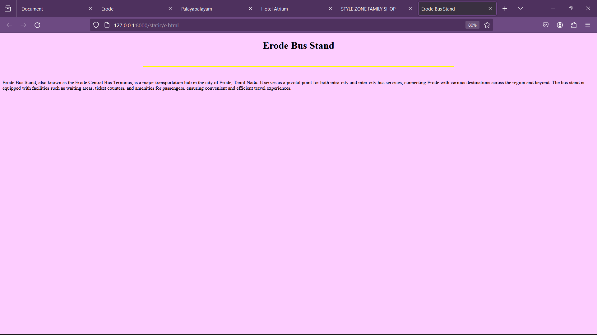

# Ex04 Places Around Me
## Date: 12-05-2024

## AIM
To develop a website to display details about the places around my house.

## DESIGN STEPS

### STEP 1
Create a Django admin interface.

### STEP 2
Download your city map from Google.

### STEP 3
Using ```<map>``` tag name the map.

### STEP 4
Create clickable regions in the image using ```<area>``` tag.

### STEP 5
Write HTML programs for all the regions identified.

### STEP 6
Execute the programs and publish them.

## CODE
### MAP.HTML
```HTML
<!DOCTYPE html>
<html lang="en">
<head>
    <meta charset="UTF-8">
    <meta name="viewport" content="width=device-width, initial-scale=1.0">
    <title>Document</title>
</head>
<body>


<map name="image-map">
    <area target="_blank" alt="Erode" title="Erode" href="home.html" coords="968,461,1074,524" shape="rect">
    <area target="_blank" alt="Palayapalayam" title="Palayapalayam" href="b.html" coords="817,583,989,633" shape="rect">
    <area target="_blank" alt="Hotel Atrium" title="Hotel Atrium" href="c.html" coords="1057,543,1176,576" shape="rect">
    <area target="_blank" alt="Style zone Family shop" title="Style zone Family shop" href="d.html" coords="1101,458,1221,495" shape="rect">
    <area target="_blank" alt="Erode bus stand" title="Erode bus stand" href="e.html" coords="891,417,1023,450" shape="rect">
</map>
</body>
</html>`
```

### 1.HTML
```HTML
<!DOCTYPE html>
<html lang="en">
<head>
    <meta charset="UTF-8">
    <meta name="viewport" content="width=device-width, initial-scale=1.0">
    <title>Erode</title>
</head>
<body style="background-color: blanchedalmond;">
    <center><h1>Erode</h1></center>
    <br>
    <hr color="red" height="10px" width="1000px">
    <br>
    <div>
        <p>The region was ruled by the Cheras during the Sangam period between the 1st and the 4th centuries CE. The medieval Cholas conquered the region in the 10th century CE. The region was ruled by Vijayanagara Empire in the 15th century followed by the Nayaks who introduced the Palayakkarar system. In the later part of the 18th century, the it came under the Kingdom of Mysore and following the Anglo-Mysore Wars, the British East India Company annexed it to the Madras Presidency in 1799. The region played a prominent role in the second Poligar War (1801) when it was the area of operations of Dheeran Chinnamalai.</p>
    </div>
    
</body>
</html>
```

### 2.HTML
```HTML
<!DOCTYPE html>
<html lang="en">
<head>
    <meta charset="UTF-8">
    <meta name="viewport" content="width=device-width, initial-scale=1.0">
    <title>Palayapalayam</title>
</head>
<body style="background-color: rgb(125, 220, 159);">
    <center><h1>Palayapalayam</h1></center>
    <br>
    <hr color="blue" height="10px" width="1000px">
    <br>
    <div>
        <p>
            Palayapalayam is a village located in the Erode district of Tamil Nadu, India. Known for its serene surroundings and agricultural activities, Palayapalayam is characterized by lush green fields and a peaceful ambiance. The village primarily relies on farming, with crops like paddy, sugarcane, and turmeric being cultivated in the region.</p>
    </div>
    
</body>
</html>
```

### 3.HTML
```HTML
<!DOCTYPE html>
<html lang="en">
<head>
    <meta charset="UTF-8">
    <meta name="viewport" content="width=device-width, initial-scale=1.0">
    <title>Hotel Atrium</title>
</head>
<body style="background-color: rgb(255, 205, 205);">
    <center><h1>Hotel Atrium</h1></center>
    <br>
    <hr color="green" height="10px" width="1000px">
    <br>
    <div>
        <p>Hotel Atrium in Erode is a popular accommodation option known for its comfortable stay and excellent hospitality. Situated in the heart of the city, it offers convenient access to key attractions and business centers. The hotel boasts modern amenities, spacious rooms, and delicious dining options, making it a preferred choice for both leisure and business travelers visiting Erode.</p>
    </div>
    
</body>
</html>
```

### 4.HTML
```HTML
<!DOCTYPE html>
<html lang="en">
<head>
    <meta charset="UTF-8">
    <meta name="viewport" content="width=device-width, initial-scale=1.0">
    <title>STYLE ZONE FAMILY SHOP</title>
</head>
<body style="background-color: #cdd7ff;">
    <center><h1>STYLE ZONE FAMILY SHOP</h1></center>
    <br>
    <hr color="orange" height="10px" width="1000px">
    <br>
    <div>
        <p>STYLE ZONE FAMILY SHOP in Erode is a renowned destination for trendy clothing and accessories catering to the entire family. With a wide range of apparel for men, women, and children, as well as stylish accessories, the store is a one-stop-shop for fashion enthusiasts. Known for its quality products and fashionable designs, STYLE ZONE FAMILY SHOP is a favorite among locals and visitors alike in Erode.</p>
    </div>
    
</body>
</html>
```

### 5.HTML
```HTML
<!DOCTYPE html>
<html lang="en">
<head>
    <meta charset="UTF-8">
    <meta name="viewport" content="width=device-width, initial-scale=1.0">
    <title>Erode Bus Stand</title>
</head>
<body style="background-color: rgb(253, 205, 255);">
    <center><h1> Erode Bus Stand</h1></center>
    <br>
    <hr color="yellow" height="10px" width="1000px">
    <br>
    <div>
        <p>Erode Bus Stand, also known as the Erode Central Bus Terminus, is a major transportation hub in the city of Erode, Tamil Nadu. It serves as a pivotal point for both intra-city and inter-city bus services, connecting Erode with various destinations across the region and beyond. The bus stand is equipped with facilities such as waiting areas, ticket counters, and amenities for passengers, ensuring convenient and efficient travel experiences.</p>
    </div>
    
</body>
</html>
```

## OUTPUT




## RESULT
The program for implementing image maps using HTML is executed successfully.
